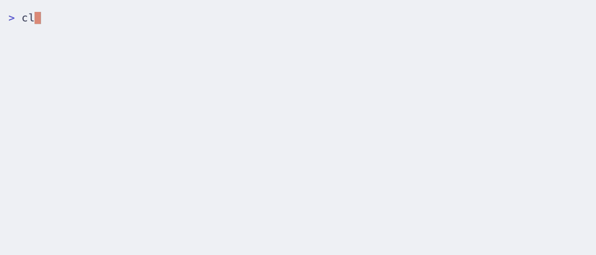

# dbskill

dontbesilent 商业诊断工具箱。从 12,307 条推文中提炼方法论，做成 Claude Code skill。

**作者**：[X](https://x.com/dontbesilent) · [小红书](https://xhslink.com/m/637xuspR4iI) · [抖音](https://v.douyin.com/pRUDhpBqOrc/)

**所有内容开放，可以整套装，也可以只拿一部分。知识包、原子库、单个公理，都能单独用。**

---

## 最新更新（v2.6.3）

**新增**：
- `/dbs-chatroom` 或 `/定向聊天室` - 定向聊天室
  - 根据话题推荐或接受用户指定的专家，模拟多角色对话
  - 两种模式：推荐模式（分析话题后推荐 3-5 位专家，确认后启动）和指定模式（直接指定人物）
  - 每位专家用独立 Agent 并行调用，动态生成专家 prompt
  - 判官总结：评估讨论质量、补盲区、给可执行建议

**改名**：
- `/chatroom-austrian` → `/dbs-chatroom-austrian`（旧触发词保留作为别名）

---

## 工具箱

### dbs 诊断工具

| Skill | 做什么 |
|---|---|
| `/dbs` | 主入口，自动路由到对的工具 |
| `/dbs-diagnosis` | 商业模式诊断。消解问题，不回答问题 |
| `/dbs-benchmark` | 对标分析。五重过滤，排除噪音 |
| `/dbs-content` | 内容创作诊断。五维检测 |
| `/dbs-hook` | 短视频开头优化。诊断 + 生成方案 |
| `/dbs-xhs-title` | 小红书标题公式。75 个爆款公式匹配 |
| `/dbs-ai-check` | AI 写作特征识别。22 条特征扫描，只诊断不改 |
| `/dbs-slowisfast` | 慢就是快。摩擦建造资产，找到值得慢做的环节 |
| `/dbs-action` | 执行力诊断。阿德勒框架（原 dbs-unblock） |
| `/dbs-deconstruct` | 概念拆解。维特根斯坦式审查 |

### chatroom 系列

| Skill | 做什么 |
|---|---|
| `/dbs-chatroom-austrian` 或 `/奥派` | 奥派经济聊天室。哈耶克 × 米塞斯 × Claude 三人对话 |
| `/dbs-chatroom` 或 `/定向聊天室` | 定向聊天室。推荐专家或指定人物，多角色对话 + 判官总结 |

### 工作流

```
diagnosis（商业模式对不对）
    ↓
benchmark（找谁模仿）
    ↓
content（内容怎么做）
    ↓ 发现开头问题        ↓ 需要标题        ↓ 在走捷径
hook（开头怎么优化）    xhs-title（标题公式）  slowisfast（慢就是快）
    ↓
action（做不动怎么办）

deconstruct（随时拆概念）
```

Skill 之间会自动推荐下一步。比如：
- diagnosis 发现心理问题 → 推荐 action
- content 发现开头问题 → 推荐 hook
- content 需要起标题 → 推荐 xhs-title
- content 检测出 AI 味 → 推荐 ai-check
- content 发现用户在走捷径 → 推荐 slowisfast
- xhs-title 标题选好 → 推荐 hook 优化开头
- benchmark 发现逃避执行 → 推荐 action

---

## 安装



**推荐：Claude Code 插件市场（一键安装，自动更新）**

```bash
claude plugin marketplace add dontbesilent2025/dbskill
claude plugin install dbs@dontbesilent-skills
```

**其他方式：**

```bash
npx skills add dontbesilent2025/dbskill
```

安装后在 Claude Code 中输入 `/dbs` 即可。

### 更新

如果你是通过 Claude Code 插件市场安装的，直接运行这 3 行：

```bash
claude plugin marketplace update dontbesilent-skills
claude plugin update dbs@dontbesilent-skills
/reload-plugins
```

如果你是通过 `npx skills add dontbesilent2025/dbskill` 安装的，重新运行一次原命令即可：

```bash
npx skills add dontbesilent2025/dbskill
```

---

## 知识库

dbskill 的知识库是完全开放的。你不需要安装整套 Skill 才能用——可以只拿走你需要的部分。

### 目录结构

```
知识库/
├── 原子库/                     # 结构化知识数据库
│   ├── atoms.jsonl             # 4,176 个知识原子（全量）
│   ├── atoms_2024Q4.jsonl      # 按季度拆分
│   ├── atoms_2025Q1.jsonl
│   ├── ...
│   └── README.md               # 字段说明
│
├── Skill知识包/                 # 提炼后的方法论文档
│   ├── diagnosis_公理与诊断框架.md
│   ├── diagnosis_问题消解案例库.md
│   ├── benchmark_对标方法论.md
│   ├── benchmark_平台运营知识.md
│   ├── content_内容创作方法论.md
│   ├── content_平台特性与案例.md
│   ├── action_心理诊断框架.md
│   ├── action_信号案例库.md
│   ├── deconstruct_语言与概念框架.md
│   └── deconstruct_解构案例库.md
│
└── 高频概念词典.md
```

### 原子库是什么

每个知识原子是一条从推文中提炼的知识点，结构化为 JSON：

```json
{
  "id": "2024Q4_042",
  "knowledge": "判断一个生意能不能做，必要条件之一是你能不能说出这个产品的颜色",
  "original": "判断一个生意能不能做，必要条件之一是你能不能说出这个产品的颜色...",
  "url": "https://x.com/dontbesilent/status/...",
  "date": "2024-10-01",
  "topics": ["商业模式与定价", "语言与思维"],
  "skills": ["dbs-diagnosis", "dbs-deconstruct"],
  "type": "anti-pattern",
  "confidence": "high"
}
```

**字段说明：**

| 字段 | 说明 |
|------|------|
| `knowledge` | 提炼后的知识点 |
| `original` | 推文原文（≤200 字） |
| `topics` | 10 个主题分类（可多选） |
| `skills` | 关联的 Skill |
| `type` | principle / method / case / anti-pattern / insight / tool |
| `confidence` | high / medium / low |

### Skill 知识包是什么

每个 Skill 有 2 个知识包——一个是框架方法论，一个是案例库。Skill 运行时会读取这些文件作为深度参考。

如果你不安装 Skill，也可以直接读这些 .md 文件。它们是独立的、可读的方法论文档。

### 怎么在你自己的项目里用

**场景 1：给你的 AI 加商业诊断能力**

把 `知识库/Skill知识包/diagnosis_公理与诊断框架.md` 的内容粘贴到你的 system prompt 里。你的 AI 就有了 6 公理 + 消解漏斗。

**场景 2：做 RAG 知识库**

把 `知识库/原子库/atoms.jsonl` 导入你的向量数据库。4,176 条结构化知识点，自带主题标签，天然适合检索。

**场景 3：只要案例**

只看 `type: "case"` 或 `type: "anti-pattern"` 的原子。大约 700+ 条真实商业案例和反面案例。

**场景 4：做 chatbot**

用 Skill 知识包里的方法论作为 system prompt，用原子库做 RAG 增强。不需要安装 Claude Code。

**场景 5：学习和研究**

按 `topics` 过滤，只看你感兴趣的领域。比如 `topics` 包含 `"心理与执行力"` 的有 296 条。

---

## 许可证

本项目采用 [CC BY-NC 4.0](https://creativecommons.org/licenses/by-nc/4.0/) 许可证。

- 个人使用、学习、研究、非商业项目：不需要署名，不需要申请
- 公开发布衍生作品（文章、工具、课程等）：请注明来源
- 商业用途：需要单独授权，请联系作者
