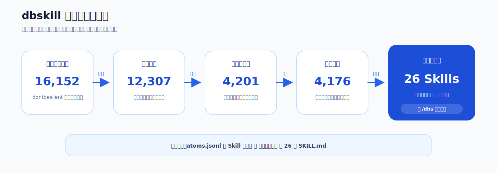

# dbskill

[简体中文](README.md) | [English](README.en.md) | [日本語](README.ja.md) | [한국어](README.ko.md) | 繁體中文

> 給創業者與內容創作者使用的中文 AI Skills 工具箱。把真實的商業、內容與行動問題交給 Agent，取得清晰判斷與可以立即執行的下一步。

[](VERSION)
[](docs/新手入门.md#skill-全目录)
[](LICENSE)

**支援：豆包、WorkBuddy、Claude Code、Codex，以及其他支援 Skills 的 Agent。**

dbskill 由 [dontbesilent](https://x.com/dontbesilent) 建立。它從 16,152 則公開貼文中，整理出 4,176 個結構化知識原子與 28 個可直接呼叫的 Skills。

[快速開始](#快速開始) · [安裝](#安裝) · [能力一覽](#能力一覽) · [完整指南](docs/新手入门.md) · [更新紀錄](https://github.com/dontbesilent2025/dbskill/releases)



## dbskill 可以處理什麼問題

你不需要先學一套複雜方法，也不需要知道該呼叫哪個工具。把眼前的商業處境、材料、選擇或卡點交給 `/dbs`，它會依照對話內容選擇適合的 Skill。

| 真實處境 | 你會得到 |
| --- | --- |
| 客戶總說貴 | 商業診斷、風險判斷與驗證動作 |
| 有一個主題，卻做不出有人看的內容 | 內容方向、開頭、標題與逐字稿優化 |
| 知道該做什麼，卻遲遲推不動 | 對行動卡點的分析與一條可開始的動作 |
| 反覆面對同類選擇，經驗無法累積 | 可回填的決策紀錄、規律與階段快照 |
| 文稿、選題、案例散落各處 | 可持續維護的內容資產工程 |

## 快速開始

安裝後，直接在 Agent 中輸入：

```text
/dbs 我做兒童程式設計課，已經有 40 個付費學員，但續費率很低。
我需要判斷問題出在產品、定價，還是我找錯了客戶。
```

`/dbs` 會讀取目前的對話資訊，選擇合適的分析路徑。完成一輪後，補充新的事實或回饋，再輸入 `/dbs`，它會判斷目前該推進什麼。

已經知道需求時，可以直接呼叫具體 Skill：

```text
/dbs-diagnosis 我做面向媽媽的收納諮詢，客戶總覺得貴。我該調整什麼？
/dbs-content 我想講「普通人別急著做個人 IP」，這個選題怎樣做成內容？
/dbs-hook 這是我短影片前 20 秒的逐字稿，請幫我優化開頭：……
/dbs-benchmark 我想研究企業服務內容帳號，應該找哪些對標？
```

## 能力一覽

| 工作目標 | 主要入口 | 常見產出 |
| --- | --- | --- |
| 判斷生意、產品、定價與客戶 | `/dbs-diagnosis` | 商業診斷、風險、驗證方案 |
| 找對標並提煉可學習的部分 | `/dbs-benchmark` | 對標篩選與研究框架 |
| 做選題、內容、標題與短影片 | `/dbs-content`、`/dbs-hook`、`/dbs-xhs-title` | 內容方向與可發布文案 |
| 檢查文稿共鳴、邏輯與傳播性 | `/dbs-resonate`、`/dbs-script-flow`、`/dbs-spread` | 修改意見與優先順序 |
| 釐清概念、目標和問題 | `/dbs-deconstruct`、`/dbs-goal`、`/dbs-good-question` | 可驗證的定義與行動目標 |
| 處理拖延、貪快與行動受阻 | `/dbs-action`、`/dbs-slowisfast` | 卡點分析與下一步動作 |
| 紀錄、復盤長期決策 | `/dbs-decision`、`/dbs-save`、`/dbs-restore`、`/dbs-report` | 本機決策檔案與報告 |
| 建立內容資產與多端 Agent 工作台 | `/dbs-content-system`、`/dbs-agent-migration`、`/dbs-bridge` | 本機工程、主題地圖與橋接方案 |
| 把本機資料夾變成知識庫 | `/dbs-knowledge` | 知識庫導航、版本規則與可直接使用的提問入口 |
| 審查本機 Skill 風險 | `/dbs-skill-cleaner` | 風險報告與確認後隔離 |

完整的 28 個 Skill、適用時機、輸入範例與常見銜接方式，見[新手入門與 Skill 全目錄](docs/新手入门.md#skill-全目录)。

## 安裝

### 豆包、WorkBuddy、Codex 與其他支援 Skills 的 Agent

在終端機執行：

```bash
npx -y skills add dontbesilent2025/dbskill -g --all
```

安裝後回到 Agent，輸入 `/dbs 新手入门` 即可開始。

### Claude Code 外掛市集

```bash
claude plugin marketplace add dontbesilent2025/dbskill
claude plugin install dbs@dontbesilent-skills
```


### 更新

已安裝 dbskill 時，直接對目前的 Agent 說：

```text
更新 dbskill
```

它會同步官方 dbskill，不會修改 `~/.dbs/` 中的存檔、報告和決策紀錄。版本變更見 [GitHub Releases](https://github.com/dontbesilent2025/dbskill/releases)。

## dbskill 怎樣工作

```text
真實任務
   ↓
/dbs 讀取上下文並選擇目前入口
   ↓
一個 Skill 完成診斷、產出或紀錄
   ↓
補充結果與回饋，再決定下一步
```

## 知識庫與本機紀錄

倉庫公開了 4,176 條結構化知識原子、依 Skill 整理的方法論文件與高頻概念詞典。

- 想查看資料範圍與欄位，閱讀[原子庫說明](知识库/原子库/README.md)。
- 想建立自己的 RAG，可使用 `知识库/原子库/atoms.jsonl`。
- 想了解各項方法，瀏覽 [Skill 知識包](知识库/Skill知识包)。
- 想跨對話保留工作，使用 `/dbs-save`、`/dbs-restore` 與 `/dbs-report`。資料預設儲存在本機的 `~/.dbs/`。



## 專案結構

```text
dbskill/
├── skills/                  # 28 個正式發布的 Skills + 1 個更新入口
├── 知识库/                   # 知識原子、方法論文件與概念詞典
├── docs/                    # 新手入門、圖示與示範素材
├── .claude-plugin/          # Claude Code 外掛市集定義
└── tools/                   # 建置與維護腳本
```

本機建置發布包：

```bash
bash tools/build-skills.sh
```

建置產物位於 `dist/skills/`；名稱帶 `beta` 的本機實驗 Skill 不會進入發布包。

## 作者與支援

作者：[@dontbesilent](https://x.com/dontbesilent) · [小紅書](https://xhslink.com/m/637xuspR4iI) · [抖音](https://v.douyin.com/pRUDhpBqOrc/)

如需加入付費問答群，可掃描 QR Code 或開啟[群組說明](https://mp.weixin.qq.com/s/V7Dr0-75VYZOLJ6lbT_s0w)。


## 授權條款

本專案採用 [CC BY-NC 4.0](LICENSE) 授權條款。

- 個人使用、學習、研究與非商業專案可以直接使用。
- 公開發布衍生作品時，請註明來源。
- 商業用途需要另行授權，請聯絡作者。
